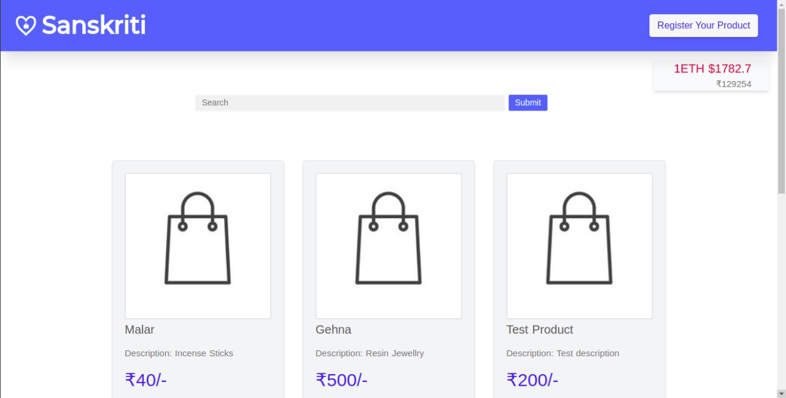
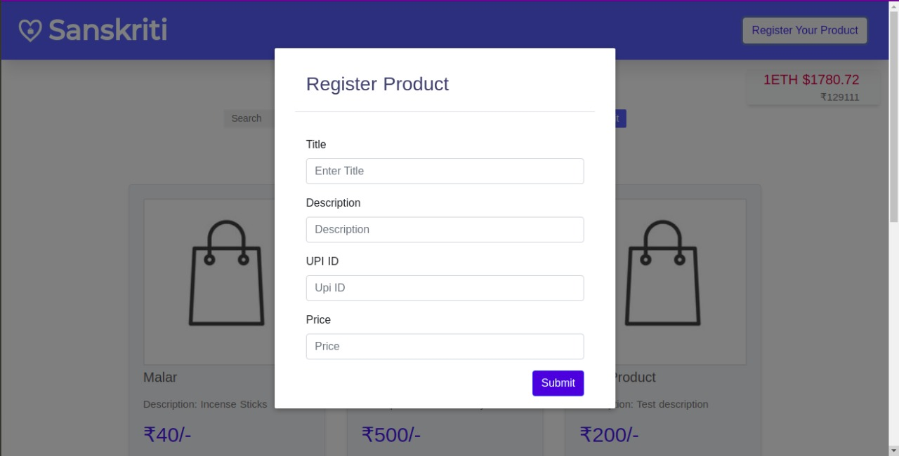
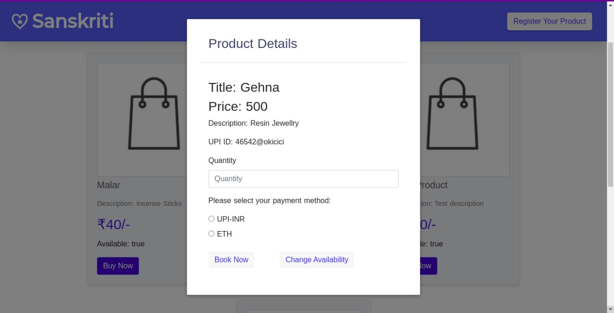

# Sanskriti
## Team Nuvs - Sanskriti
----

### First Time Installation :
After you've cloned this repository. Make sure you have npm@6.14.12 and node@14.16.1 

1. In the repository goto dapp-ui folder run cmd
```
npm i
```
2. Go to folder 'others'
```
npm i
```
3. Install Metamask Google extention
4. Install [Ganache](https://www.trufflesuite.com/ganache) from TruffleSuite (Local Ethereum Chain)
5. Run a Quick Ethereum Chain
6. Connect Metamask to the local Ganache Ethereum chain
7. Run remix IDE on your browser upload, compile, deploy the 'contracts/Sanskriti.sol' contract.
8. Copy the ABI from compiler paste in /dapp-ui/utils/SanskritiABI.json 
9. Copy the address to the Deployed contract paste it in dapp-ui/utils/utils.js
----
### To Run
1. Go to the repository folder.
2. On the terminal
```
cd dapp-ui
npm run dev  
```
3. On a new terminal
```
cd others
node app.js
```
## Working
- - - - 





